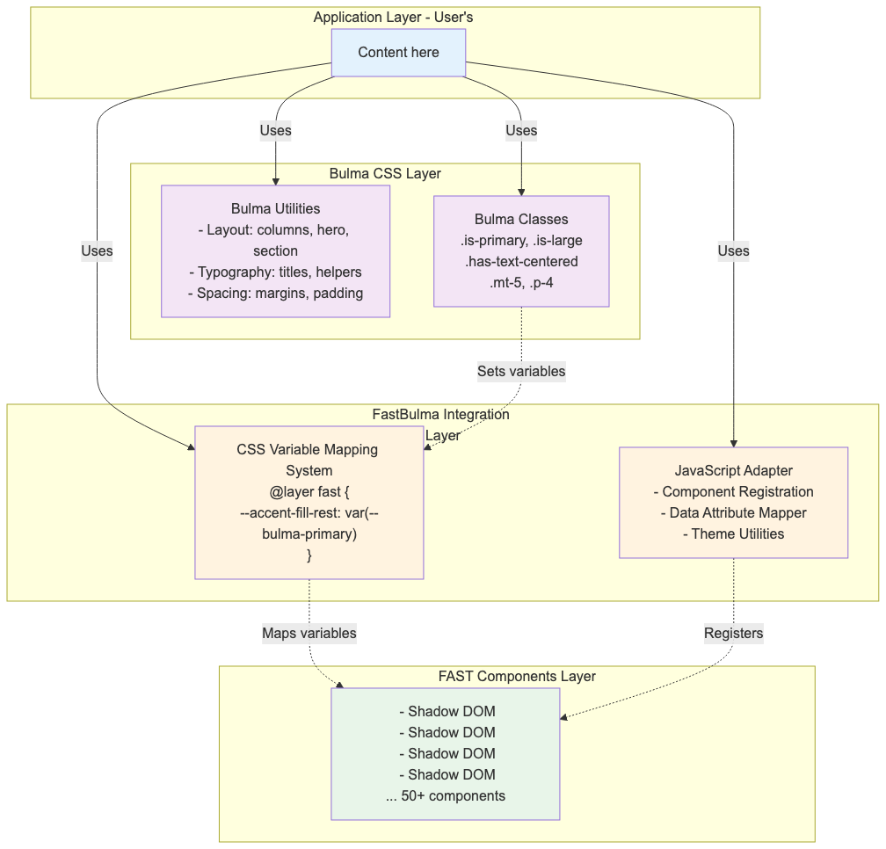
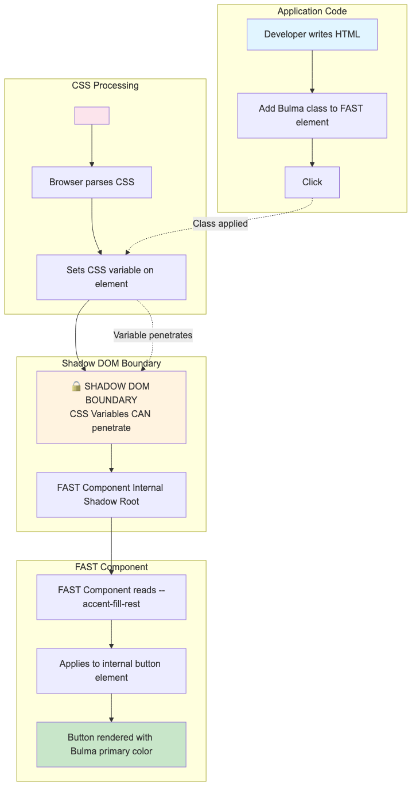

# FastBulma Architecture

This document provides a detailed visual explanation of FastBulma's architecture and how components work together.

## System Overview

FastBulma uses a **layered architecture** that separates concerns between layout utilities (Bulma) and interactive components (FAST), connected through CSS variables.



### Layer Breakdown

#### Application Layer

- **What**: User's HTML and content
- **Responsibility**: Structure and content using Bulma utilities
- **Example**: Sections, columns, typography

#### FastBulma Integration Layer

- **What**: CSS Variable Mapping + JavaScript Adapter
- **Responsibility**: Bridges Bulma classes to FAST components
- **Components**:
  - CSS Variable Mapping System (maps `--bulma-primary` to `--accent-fill-rest`)
  - JavaScript Adapter (registers FAST components, handles data attributes)

#### Bulma CSS Layer

- **What**: Layout and typography utilities
- **Responsibility**: Page layout, responsive design, helper classes
- **Components**:
  - Layout: columns, level, hero, section, container
  - Typography: titles, subtitles, content
  - Helpers: spacing, sizing, visibility, colors

#### FAST Components Layer

- **What**: Encapsulated web components with Shadow DOM
- **Responsibility**: Interactive UI components
- **Components**: 50+ components (buttons, cards, forms, etc.)

______________________________________________________________________

## CSS Variable Bridge Pattern

The core innovation of FastBulma is the **CSS Variable Bridge Pattern** that allows Bulma classes to style FAST components across Shadow DOM boundaries.

### How It Works



### Step-by-Step Process

1. **Developer adds Bulma class to FAST element**

   ```html
   <fast-button class="is-primary">Click me</fast-button>
   ```

1. **CSS variable is set on the element**

   ```css
   .is-primary {
     --accent-fill-rest: var(--bulma-primary);
   }
   ```

1. **CSS variable penetrates Shadow DOM boundary**

   - CSS custom properties CAN cross Shadow DOM boundaries
   - Regular CSS rules CANNOT cross Shadow DOM boundaries
   - This is the key to FastBulma's architecture

1. **FAST component reads the variable internally**

   - FAST component's Shadow Root accesses `--accent-fill-rest`
   - Applies it to internal button element
   - Button renders with Bulma primary color

### Why This Matters

**Problem**: Shadow DOM encapsulation prevents external CSS from affecting component internals.

**Solution**: CSS variables are designed to penetrate Shadow DOM, allowing theming without breaking encapsulation.

**Benefit**: Bulma classes work seamlessly with FAST components.

______________________________________________________________________

## Shadow DOM Compatibility

### Full Support Components

These FAST components work perfectly with Bulma modifier classes:

| Component | Bulma Support | Limitations |
|-----------|----------------|-------------|
| `fast-button` | ✓ Full (color, size, state) | None |
| `fast-card` | ✓ Full (color variant) | None |
| `fast-dialog` | ✓ Full (size variant) | None |

### Partial Support Components

These components work with some limitations:

| Component | Bulma Support | Limitations |
|-----------|----------------|-------------|
| `fast-text-field` | ✓ Partial (size, fullwidth) | Border styling limited |
| `fast-select` | ✓ Partial (size, state) | Icon styling limited |
| `fast-tabs` | ✓ Good (size, position) | Tab panel styling limited |

### Limited Support Components

These components require workarounds:

| Component | Bulma Support | Workaround Needed |
|-----------|----------------|------------------|
| `fast-checkbox` | △ Limited (size only) | Use `::part()` or CSS variables |
| `fast-radio-group` | △ Limited (size only) | Use `::part()` or CSS variables |
| `fast-data-grid` | ✗ Minimal | Use FAST column configuration API |

______________________________________________________________________

## Component API Patterns

### Custom Element Usage

FastBulma uses FAST custom elements directly with Bulma classes:

```html
<!-- Correct: Bulma class on the FAST element itself -->
<fast-button class="is-primary is-large">Click me</fast-button>

<!-- Wrong: Bulma class on wrapper won't affect Shadow DOM -->
<div class="is-primary">
  <fast-button>Click me</fast-button>
</div>
```

### Slot Conventions

FAST components use named slots for content organization:

```html
<fast-card>
  <h3 slot="heading">Card Title</h3>
  <p>Content goes here (default slot)</p>
  <div slot="actions">Footer actions</div>
</fast-card>
```

| Component | Slot Name | Bulma Equivalent |
|-----------|-----------|-------------------|
| `fast-card` | `heading` | `.card-header` |
| `fast-card` | (default) | `.card-content` |
| `fast-card` | `actions` | `.card-footer` |
| `fast-dialog` | `heading` | Modal title |
| `fast-menu-button` | `start` | Icon placement |

______________________________________________________________________

## JavaScript Integration

### Component Registration Modes

FastBulma supports three registration modes:

#### Mode 1: Global Registration (v1.0)

Register all components upfront for simplicity.

#### Mode 2: Eager Registration (v1.1)

Register components as they appear in the DOM.

#### Mode 3: Lazy Registration (v1.1)

Register components only when they enter the viewport.

### Event Handling

FAST components use standard DOM events with Shadow DOM retargeting:

```javascript
const button = document.querySelector('fast-button');
button.addEventListener('click', (event) => {
  // event.target is the <fast-button> element (retargeted)
  // NOT the internal button in Shadow DOM
  console.log(event.target); // <fast-button>
  console.log(event.composedPath()); // Full path including Shadow DOM
});
```

### Form Integration

FAST components participate in native forms:

```html
<form id="my-form">
  <fast-text-field name="username"></fast-text-field>
  <fast-button type="submit">Submit</fast-button>
</form>

<script>
  const form = document.getElementById('my-form');
  form.addEventListener('submit', (e) => {
    e.preventDefault();
    const formData = new FormData(form);
    console.log(formData.get('username')); // Works!
  });
</script>
```

**Note**: Requires form association polyfill for older browsers (Chrome < 77, Firefox < 79, Safari < 16.4).

______________________________________________________________________

## Key Takeaways

1. **CSS Variables are the Bridge**: They connect Bulma classes to FAST components
1. **Shadow DOM is Preserved**: Components remain encapsulated while being themeable
1. **Vanilla JavaScript Only**: No framework dependencies required
1. **Drop-in Replacement**: Existing Bulma projects can adopt FAST components incrementally

## Related Documentation

- [Implementation Plan](../IMPLEMENTATION_PLAN.md) - Full technical implementation details
- [Migration Guide](migration-guide.md) - How to migrate from Bulma
- [Theming](theming.md) - Customization and theme creation
