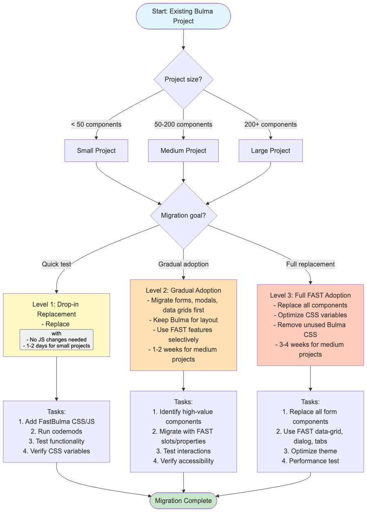

# FastBulma Migration Guide

This guide helps you migrate from pure Bulma to FastBulma. Choose the migration level that fits your project size and goals.

## Migration Decision Tree

Use this decision tree to choose your migration approach:



---

## Quick Assessment

### Project Size
- **Small** (< 50 components): 1-2 days migration
- **Medium** (50-200 components): 1-2 weeks migration
- **Large** (200+ components): 3-4 weeks migration

### Migration Goals
- **Quick test**: Want to try FAST components without major changes
- **Gradual adoption**: Want FAST features in specific areas
- **Full replacement**: Want complete FAST component ecosystem

---

## Level 1: Drop-in Replacement

**Target**: Teams wanting FAST components without changing HTML structure

### Time Investment
- Small projects: **1-2 days**
- Medium projects: **3-5 days**
- Large projects: **1-2 weeks**

### What You Do

1. Add FastBulma CSS and JS to your page
   ```html
   <link rel="stylesheet" href="https://cdn.jsdelivr.net/npm/bulma@1.0.2/css/bulma.min.css">
   <link rel="stylesheet" href="https://cdn.jsdelivr.net/npm/fastbulma@latest/css/fastbulma.min.css">
   ```

2. Replace HTML elements
   ```html
   <!-- Before -->
   <button class="button is-primary">Click me</button>

   <!-- After -->
   <fast-button class="is-primary">Click me</fast-button>
   ```

3. Run automated codemods (available in v1.0)
   ```bash
   fastbulma-migrate src/
   ```

4. Test basic functionality (clicks, form submission)
5. Verify CSS variables are applied
6. Check browser console for errors

### What You Get
- ✅ FAST components automatically
- ✅ Minimal code changes
- ❌ No access to FAST-specific features (slots, advanced properties)

### Example
```html
<!-- Before (Bulma) -->
<button class="button is-primary is-large">Primary Button</button>

<!-- After (FastBulma) -->
<fast-button class="button is-primary is-large">Primary Button</fast-button>
```

---

## Level 2: Gradual Adoption

**Target**: Teams wanting to use FAST features in specific areas

### Time Investment
- Small projects: **3-5 days**
- Medium projects: **1-2 weeks**
- Large projects: **3-4 weeks**

### What You Do

1. Identify high-value components to migrate:
   - Forms (text fields, selects, checkboxes)
   - Modals/dialogs
   - Data grids
   - Dropdowns

2. Migrate identified components with FAST features:
   ```html
   <!-- Keep Bulma for layout -->
   <div class="columns">
     <div class="column">
       <!-- Migrate to FAST with slots -->
       <fast-card class="is-primary">
         <h3 slot="heading">User Profile</h3>
         <fast-text-field placeholder="Name"></fast-text-field>
         <fast-button appearance="accent" slot="actions">Save</fast-button>
       </fast-card>
     </div>
   </div>
   ```

3. Keep Bulma for layout and typography
4. Test component interactions thoroughly
5. Verify accessibility with screen reader

### What You Get
- ✅ Best of both worlds (Bulma layout + FAST components)
- ✅ Gradual learning curve
- ✅ FAST features where you need them
- ❌ Some inconsistency in component patterns

### When to Use Level 2
- You want FAST's accessibility features
- You need advanced form components
- You want to try FAST incrementally
- You have limited time/resources

---

## Level 3: Full FAST Adoption

**Target**: New projects or teams ready for complete migration

### Time Investment
- Small projects: **1-2 weeks**
- Medium projects: **3-4 weeks**
- Large projects: **2-3 months**

### What You Do

1. Replace all form components with FAST equivalents:
   ```html
   <fast-text-field name="username"></fast-text-field>
   <fast-select name="country">
     <fast-option value="us">United States</fast-option>
   </fast-select>
   <fast-checkbox>Agree to terms</fast-checkbox>
   ```

2. Use FAST data-grid instead of Bulma tables
3. Use FAST dialog instead of Bulma modal
4. Use FAST menu-button instead of Bulma dropdown
5. Keep Bulma for columns, hero, section, typography
6. Optimize CSS variables for your theme

### What You Get
- ✅ Consistent component API
- ✅ Full FAST feature set
- ✅ Best accessibility
- ❌ Steeper learning curve
- ❌ More code changes

### When to Use Level 3
- Starting a new project
- Complete rewrite in progress
- Full commitment to FAST ecosystem
- Have resources for training

---

## Pre-Migration Checklist

### Planning Phase
- [ ] Audit current Bulma usage in your project
- [ ] Identify components to migrate
- [ ] Estimate migration effort
- [ ] Create migration branch
- [ ] Set up FastBulma in staging environment

### Level 1 Execution
- [ ] Add FastBulma CDN links
- [ ] Run automated codemods
- [ ] Test basic functionality
- [ ] Verify CSS variables
- [ ] Check console for errors

### Level 2 Execution
- [ ] Identify high-value components
- [ ] Migrate with FAST slots/properties
- [ ] Test keyboard navigation
- [ ] Verify accessibility

### Level 3 Execution
- [ ] Replace all form components
- [ ] Use FAST data-grid/dialog/tabs
- [ ] Optimize CSS variables
- [ ] Remove unused Bulma CSS
- [ ] Performance test

### Post-Migration
- [ ] Run automated test suite
- [ ] Manual QA testing
- [ ] Accessibility audit
- [ ] Performance benchmarking
- [ ] Deploy and monitor

---

## Common Migration Issues

### Issue 1: CSS Variables Not Applied

**Problem**: FAST components don't inherit Bulma CSS variables

**Solution**: Ensure Bulma classes are on the FAST element itself:
```html
<!-- ✗ WRONG -->
<div class="is-primary">
  <fast-button>Click</fast-button>
</div>

<!-- ✓ CORRECT -->
<fast-button class="is-primary">Click</fast-button>
```

### Issue 2: Event Handlers Not Firing

**Problem**: Click events on FAST components not triggering

**Solution**: Events work but `event.target` is retargeted:
```javascript
document.querySelector('fast-button').addEventListener('click', handler);
// event.target is <fast-button>, not internal button
```

### Issue 3: Form Validation Not Working

**Problem**: Native form validation not working with FAST components

**Solution**: Add form association polyfill:
```html
<script src="https://cdn.jsdelivr.net/npm/@github/form-associated-element-boundary@latest/dist/form-associated-element-boundary.min.js"></script>
```

---

## Migration Timeline Estimates

| Project Size | Level 1 | Level 2 | Level 3 |
|--------------|---------|---------|---------|
| Small (< 50) | 1-2 days | 3-5 days | 1-2 weeks |
| Medium (50-200) | 3-5 days | 1-2 weeks | 3-4 weeks |
| Large (200+) | 1-2 weeks | 3-4 weeks | 2-3 months |

---

## Tools and Resources

### Automated Codemods
```bash
# Install codemod CLI
npm install -g jscodeshift

# Run button migration
jscodeshift -t fastbulma-codemods/src/button.js src/

# Run all codemods
fastbulma-migrate src/
```

### Browser Compatibility

**Tier 1** (Latest 2 versions) - Full functionality
**Tier 2** (Last 4 versions) - Core functionality with polyfills

**Required Polyfills**:
- Form association: `@github/form-associated-element-boundary`
- Required for: Safari < 16.4, Firefox < 79, Chrome < 77

### Support Resources

- [Architecture Documentation](architecture.md) - Technical details
- [Implementation Plan](../IMPLEMENTATION_PLAN.md) - Full technical spec
- [Component API Reference](../IMPLEMENTATION_PLAN.md#component-api-specification) - API details

---

## Success Criteria

Your migration is successful when:
- ✅ All Bulma classes work with FAST components
- ✅ CSS variables apply correctly
- ✅ Forms submit properly
- ✅ Keyboard navigation works
- ✅ Accessibility standards met (WCAG 2.1 AA)
- ✅ Performance benchmarks met
- ✅ No console errors
